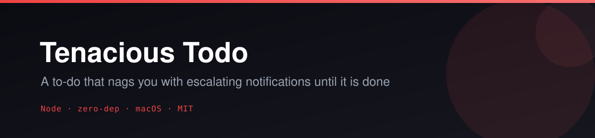
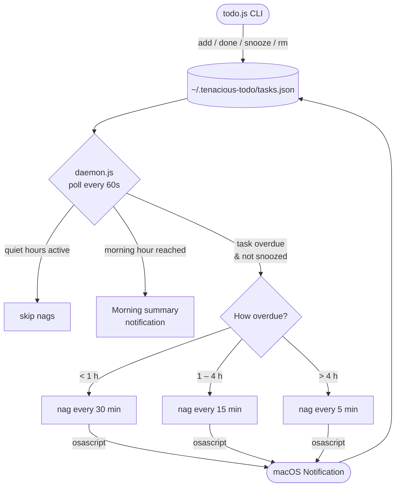

<p align="center"></p>

<p align="center">
  <a href="LICENSE"></a>
  
  
  
  
  
</p>

# ✅ Tenacious Todo

**A to-do CLI that nags you with escalating macOS notifications until each task is actually done.**

Most to-do apps let you ignore reminders indefinitely. Tenacious Todo does not. The longer a task sits overdue, the more aggressively the daemon pings you — every 30 minutes, then every 15, then every 5 — via native macOS notifications fired by `osascript`. It runs as a background launchd agent, costs zero npm dependencies, and stores everything in a single plain-JSON file you can inspect and back up freely.

## ✨ Features

- **Escalating nags** — overdue tasks ping you at 30m → 15m → 5m intervals the longer they are ignored
- **Recurring tasks** — `daily`, `weekly`, `weekdays`, `monthly`, `yearly`, or `every 3d` / `every 2w` / `every 4h`; completing a recurring task auto-schedules the next occurrence
- **Snooze** — silence a task for `30m`, `2h`, `tomorrow`, or a specific `"YYYY-MM-DD HH:MM"`
- **Tags + rich filtering** — tag tasks and filter `list` by `--tag`, `--overdue`, `--today`, `--done`, `--all`
- **Quick views** — `today` and `overdue` shortcut commands
- **Stats + streak** — completion rate, per-priority counts, and a daily completion streak
- **Morning summary** — a single "Good morning" notification at 08:00 with your pending/overdue count
- **Quiet hours** — no nag notifications from 23:00–08:00 (configurable)
- **Polished CLI output** — aligned box-drawing columns, priority/status color coding, relative due times ("in 2h", "3d overdue"), TTY-aware (no color when piped)
- **Scriptable** — `list --json` emits a JSON array for piping into `jq` and friends
- **Isolated store** — `TENACIOUS_HOME` env var points the store at any directory; used by tests and eval without touching your real data
- **Zero dependencies** — pure Node.js stdlib + macOS `osascript`; no `node_modules` ever needed

## 🎬 How it works



## 🚀 Quickstart

```bash
# Clone
git clone https://github.com/Alchemist-X/tenacious-todo.git
cd tenacious-todo

# No install step — zero dependencies. Run directly:
node todo.js --help

# Add tasks
node todo.js add "Ship feature" --due "2026-06-10 17:00" --priority high --tag work --note "Review PR first"
node todo.js add "Daily standup" --due "2026-06-07 09:00" --repeat weekdays --tag work
node todo.js add "Buy groceries" --priority low --tag personal

# List all pending tasks (colored, aligned table)
node todo.js list

# Filtered views
node todo.js list --overdue
node todo.js list --today
node todo.js list --tag work
node todo.js list --done
node todo.js list --all          # pending + done
node todo.js list --json         # machine-readable JSON array
node todo.js list --overdue --json | jq '.[].text'

# Quick view shortcuts
node todo.js today
node todo.js overdue

# Mark done (recurring tasks auto-schedule the next occurrence)
node todo.js done <id>

# Snooze reminders
node todo.js snooze <id> 30m
node todo.js snooze <id> 2h
node todo.js snooze <id> tomorrow
node todo.js snooze <id> "2026-06-12 09:00"

# Remove a task
node todo.js rm <id>

# Completion stats and daily streak
node todo.js stats

# Install the background daemon (starts at login via launchd)
bash install-daemon.sh

# Fire all due notifications once — useful for testing
node daemon.js --once
```

## ⚙️ Configuration

**No config file needed to get started.** All defaults are sensible out of the box. To tune behavior, edit `~/.tenacious-todo/tasks.json` → `config`:

| Key | Default | Description |
|-----|---------|-------------|
| `quietHoursStart` | `23` | Hour (0–23) when nag notifications stop |
| `quietHoursEnd` | `8` | Hour (0–23) when nag notifications resume |
| `morningHour` | `8` | Hour at which the daily summary fires |

**Isolated store** — set `TENACIOUS_HOME` to any directory to redirect the task store. Both `todo.js` and `daemon.js` honor it. Useful for testing without touching real data:

```bash
TENACIOUS_HOME=/tmp/ttodo-scratch node todo.js add "test task" --due "2026-06-10 09:00"
TENACIOUS_HOME=/tmp/ttodo-scratch node todo.js list
```

**Repeat schedules:**

| Value | Meaning |
|-------|---------|
| `daily` | Every 24 hours |
| `weekly` | Every 7 days |
| `weekdays` | Mon–Fri, skipping weekends |
| `monthly` | Same day next month (clamped: Jan 31 → Feb 28/29) |
| `yearly` | Same date next year |
| `every 3d` | Every 3 days |
| `every 2w` | Every 2 weeks |
| `every 4h` | Every 4 hours |

Any `--repeat` value that doesn't match the above is **rejected at add-time** with a clear error — a task can never be silently accepted with a schedule that would never reschedule.

## 🗺️ Roadmap / Needs

Contributions are very welcome. Some areas worth exploring:

- **`edit` command** — update text, due date, or priority in-place
- **Interactive TUI** — an `npm run tui` mode with keyboard navigation
- **Linux notification support** — `notify-send` / `systemd` daemon alternative
- **iCloud / Dropbox sync** — point `TENACIOUS_HOME` at a synced folder (works today as a workaround)
- **Shell completions** — bash/zsh/fish completion scripts

## 🧪 Tests & Eval

Pure store/filter/time logic is covered by Node's built-in test runner — no test dependencies:

```bash
node --test    # or: npm test
```

A zero-dependency end-to-end eval harness lives under `eval/`. It runs every store-touching check against a fresh isolated temp dir, never touching your real store:

```bash
node eval/eval.mjs   # or: npm run eval
```

Prints `PASS C<N>` / `FAIL C<N>` per criterion and a final `RESULT: X/Y passed` line. See [`eval/criteria.md`](eval/criteria.md) for the human-readable criteria.

## 📋 Requirements

- **macOS** — notifications use `osascript`; the daemon installer uses `launchd`. The CLI and test suite run on any platform.
- **Node.js 18+** — ES modules, built-in test runner; `node_modules` are never needed.
- **Notification permission** — on first run macOS may prompt you to allow Terminal (or whichever app runs node) to send notifications. Grant it in System Settings → Notifications.

## 📄 License

MIT © 2026 [Alchemist-X](https://github.com/Alchemist-X)

---

<p align="center">⭐ Star this repo if it saves you from your own procrastination.</p>
